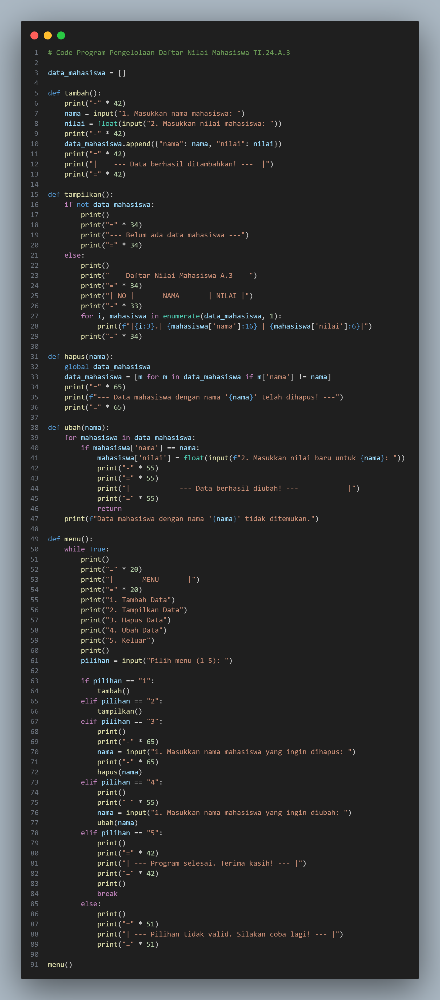
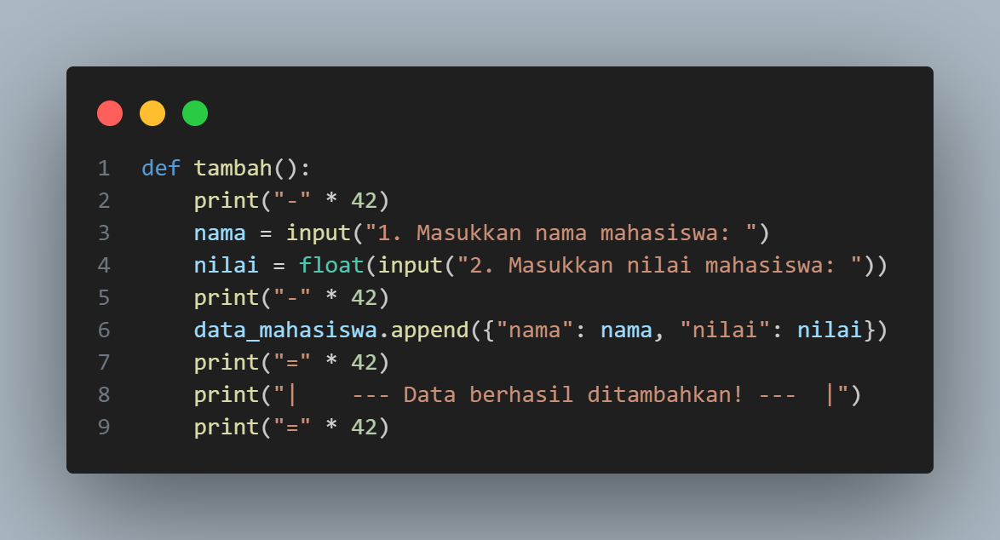
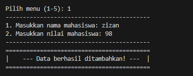
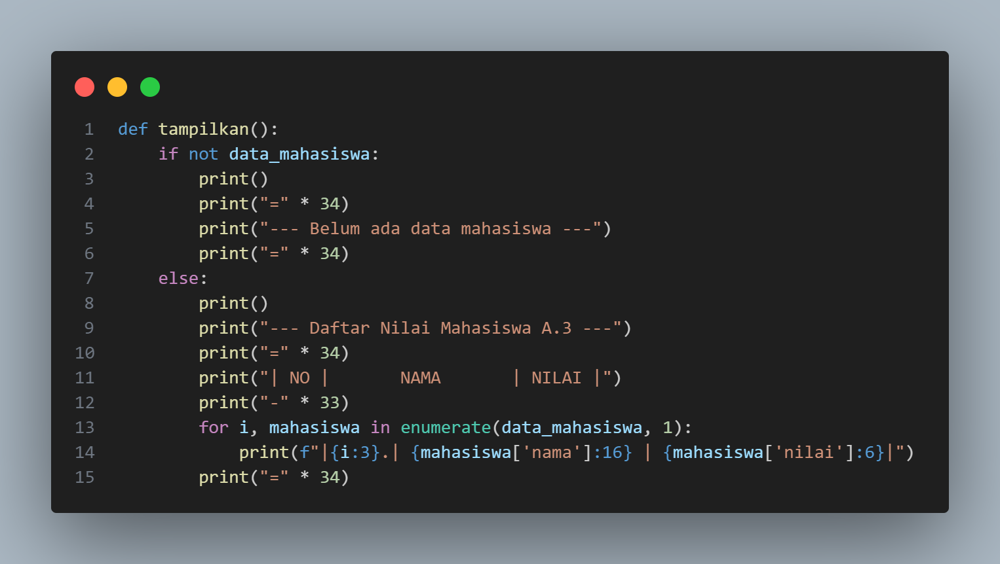
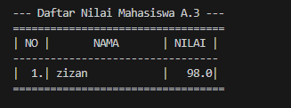
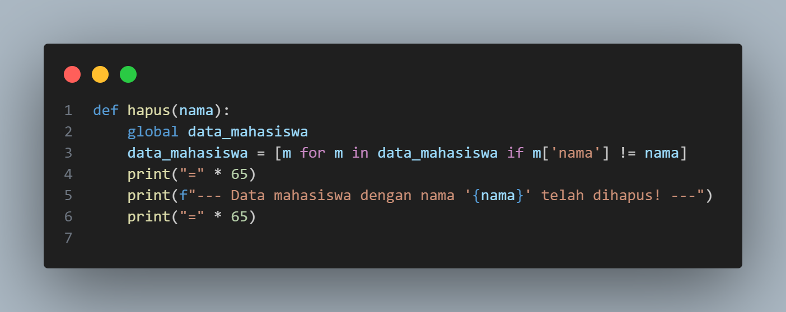
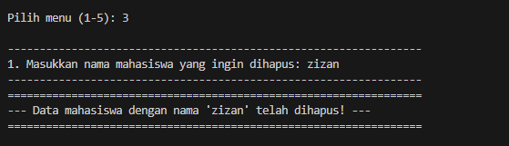
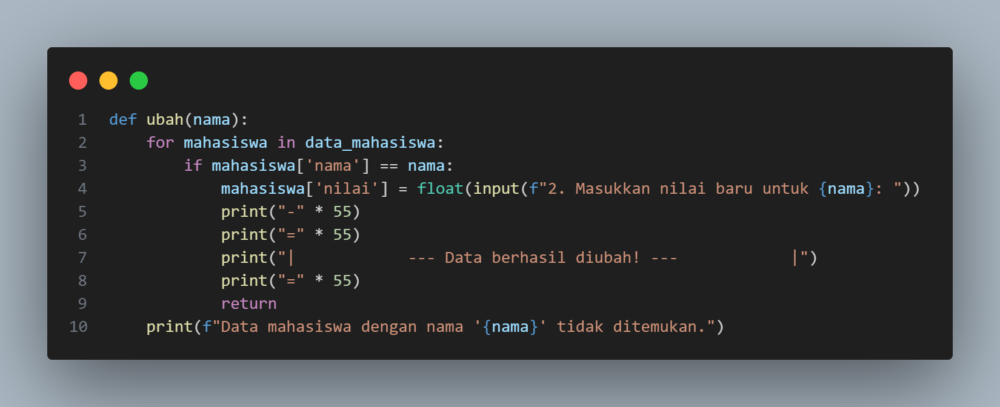
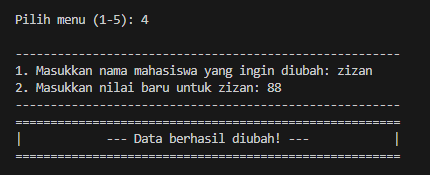

# Data Diri

NAMA    : Zizantara Arzeva Cakra Kahana

NIM     : 312410398

Kelas   : TI.24.A.3

## FLowchart

## Code Program

## Penjelasan Proram

### Pilihan 1

pada source code ini menunjukan proses menambahkan data pada program, data yang di tambahkan berupa nama dan nilai mahasiswa. Output yang di hasilkan Sebagai berikut :

### Pilihan 2

source code ini digunakan untuk menampilkan data yang sudah di tambahkan pada source code di atas, Berikut Output yang dihasilkan :

### Pilihan 3

source code ini berfungsi untuk menghapus data yang sudah tersimpan, Berikut Output yang dihasilkan :

### Pilihan 4

source code ini berfungsi untuk merubah data yang sudah tersimpan, Berikut Output yang dihasilkan :

